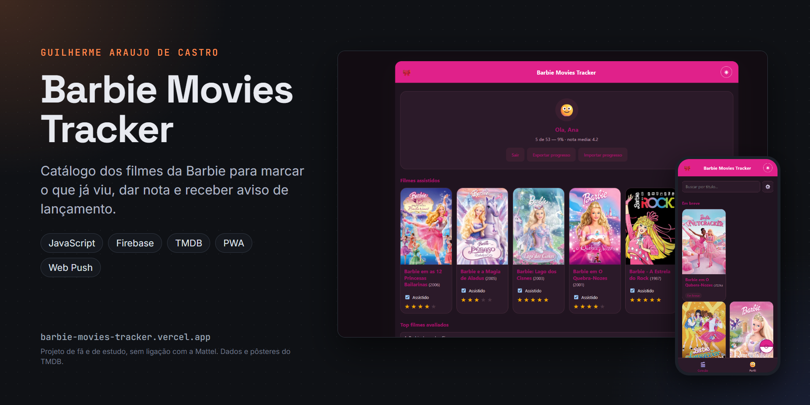
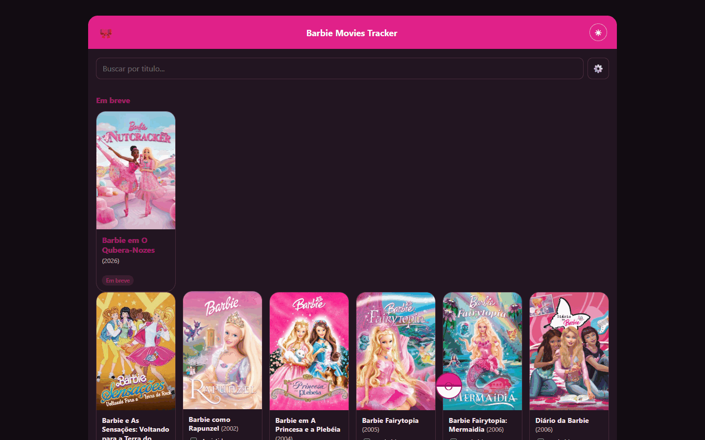
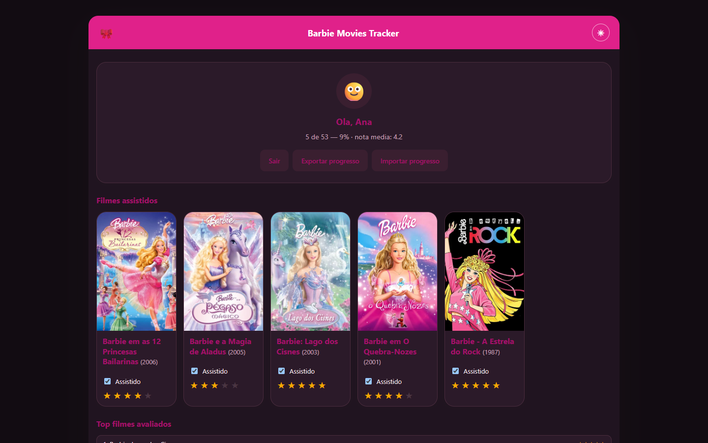
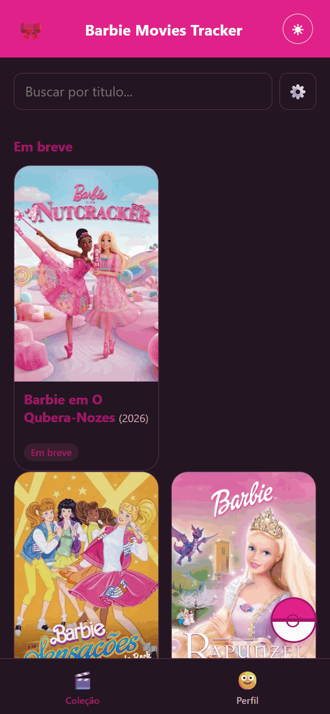

# Barbie Movies Tracker



Catálogo dos filmes da Barbie pra marcar os que você já viu, dar nota, escrever uma resenha curta e acompanhar o progresso. Os dados dos filmes vêm do TMDB.

Site: https://barbie-movies-tracker.vercel.app

[](https://github.com/GuilhermeAraujoDeCastro/barbie-movies-tracker/actions/workflows/ci.yml)

| Coleção | Perfil e estatísticas | No celular |
|---|---|---|
|  |  |  |

## O que tem

- Lista dos filmes da franquia com capa, ano e gênero, busca, filtro por ano e por não vistos, e seções separadas pros vistos, os que faltam e os que ainda vão lançar. Enquanto o TMDB responde, aparecem cards de carregamento no lugar da tela em branco.
- Ordem alfabética, por ano ou por nota.
- Ficha de cada filme com sinopse, elenco, duração, nota de 1 a 5 e resenha.
- Barra de progresso e estatísticas: gêneros mais vistos, nota média por década, filmes mais bem avaliados e o ano com mais lançamentos que você viu.
- Modo visitante, que guarda tudo no próprio navegador, sem conta.
- Login com Google ou e-mail pelo Firebase, pra levar o progresso pra outros aparelhos.
- Link público só leitura pra mostrar sua lista pra alguém, e comparação com o link de um amigo pra ver os filmes que os dois já viram e avaliaram.
- Backup do progresso em arquivo e importação de volta.
- Notificação quando sai filme novo da Barbie no TMDB (opcional).
- Um aviso curto na primeira visita explicando os modos visitante, Google e e-mail.
- Tema claro e escuro, layout pra celular e instalação como app (PWA).

## Como a lista é montada

Buscar "Barbie" no TMDB traz muito filme sem relação com a franquia. Por isso a lista (em `js/tmdb.js`) junta a busca por texto com os filmes das produtoras da Mattel. Animação e família entram; terror, crime, documentário e guerra saem. Título sem a Mattel entre as produtoras só aparece se tiver um mínimo de votos no TMDB.

## Tecnologias

JavaScript puro em módulos ES, sem framework. Firebase Authentication e Firestore guardam as contas; o modo visitante usa `localStorage`. A notificação de filme novo roda numa function da Vercel (`api/notify-new-movies.js`) com web-push e firebase-admin, agendada pelo cron da Vercel uma vez por dia. O Sentry é opcional, pra acompanhar erros em produção.

No build, os nomes internos do JavaScript são encurtados e o JS, o CSS e o HTML saem minificados, o que deixa os arquivos menores. Isso não protege nada: qualquer pessoa ainda consegue ler o que roda no navegador. O que é segredo de verdade (a chave do TMDB e a conta de serviço do Firebase) fica só nas functions da Vercel.

## Estrutura

```
barbie-movies-tracker/
├── index.html
├── sw.js                    service worker (cache offline)
├── manifest.json
├── firestore.rules          regras de segurança do banco
├── vercel.json              build e cron da notificação
├── api/
│   ├── notify-new-movies.js
│   └── tmdb.js              proxy da TMDB (a chave fica no servidor)
├── css/
├── js/
│   ├── main.js              liga a tela aos módulos
│   ├── tmdb.js              busca e filtro dos filmes
│   ├── filters.js, progress.js, ratings.js, reviews.js, stats.js
│   ├── storage-local.js     modo visitante
│   ├── firebase-app.js      login e dados na nuvem
│   ├── backup.js
│   └── config.example.js    modelo das chaves
└── scripts/                 build e servidor local
```

## Rodando na sua máquina

```bash
npm install
copy js\config.example.js js\config.js
npm run dev
```

No Linux ou no macOS, troque o `copy` por `cp js/config.example.js js/config.js`. Preencha o `js/config.js` com a sua chave do TMDB; as instruções estão no próprio arquivo. O Firebase só é necessário pro login, pro link público e pras notificações. O `js/config.js` fica fora do git.

## Deploy na Vercel

O build gera o `js/config.js` a partir das variáveis de ambiente do projeto na Vercel, então as chaves não ficam no repositório:

- `TMDB_API_KEY`, que fica só no servidor: no site publicado o navegador busca os filmes por `api/tmdb.js`, que acrescenta a chave
- `FIREBASE_API_KEY`, `FIREBASE_AUTH_DOMAIN`, `FIREBASE_PROJECT_ID`, `FIREBASE_STORAGE_BUCKET`, `FIREBASE_MESSAGING_SENDER_ID`, `FIREBASE_APP_ID`
- opcionais: `SENTRY_DSN` e `VAPID_PUBLIC_KEY`

A function de notificação também usa `VAPID_PRIVATE_KEY`, `VAPID_SUBJECT`, `FIREBASE_CLIENT_EMAIL`, `FIREBASE_PRIVATE_KEY` e `CRON_SECRET`. Sem o `CRON_SECRET` ela recusa qualquer chamada, inclusive a do cron. Só avisa filme lançado nos últimos 60 dias ou que ainda vai sair.

O GitHub Actions roda o build de produção a cada push, com chaves falsas, pra pegar erro antes da Vercel.

As regras do Firestore ficam em `firestore.rules` e precisam ser publicadas no Firebase Console (Firestore Database, Regras).

## Créditos e avisos

Dados e pôsteres dos filmes vêm do [TMDB](https://www.themoviedb.org/); detalhes em [CREDITS.md](CREDITS.md). Barbie é marca da Mattel. Este é um projeto de fã e de estudo, sem fins lucrativos e sem ligação com a Mattel ou com o TMDB.

## Licença e contato

Código sob a licença MIT (veja [LICENSE](LICENSE)). Feito por Guilherme Araujo de Castro: [portfólio](https://guilhermearaujodecastro.vercel.app) · [LinkedIn](https://www.linkedin.com/in/guilherme-araujo-de-castro) · guilhermeacastro.2006@gmail.com
